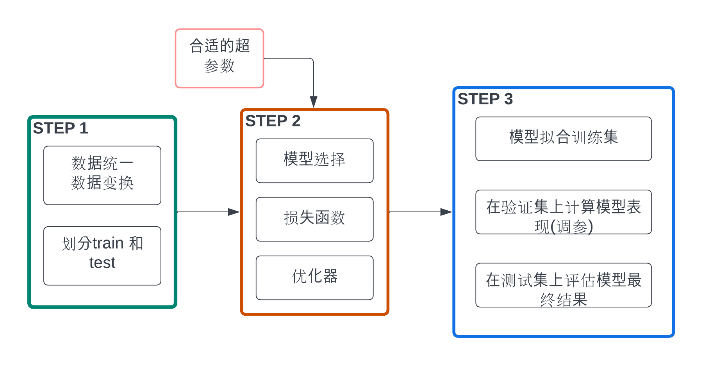
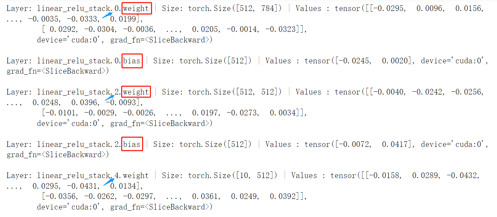

# PyTorch主要组成模块

## 深度学习流程:



## STEP1：

### 数据读入

- 想要`dataset code` 与 `model training code`分开

- [官方教程](https://pytorch.org/tutorials/beginner/basics/data_tutorial.html)
- 使用`torch.utils.data.DataLoader`和`torch.utils.data.Dataset`
  - `Dataset`: stores **samples** & corresponding **labels** 定义好数据的格式&数据变换形式
  - `DataLoader`: wraps an **iterable** around `Dataset` to enable easy access 用iterative的方式不断读入batch数据
- eg: 读入Fashion-MNIST dataset from `TorchVision`库

```python
# 方式1：使用自带数据集，从网上直接下载
# root--path where the train/test data is stored
# train--train or test dataset
# download=True--download from internet if not available at root
# 使用内置数据集 简单转换
from torchvision import datasets
training_data = datasets.FashionMNIST(
    root="data",
    train=True,
    download=True,
    transform=transforms.ToTensor() 
)

test_data = datasets.FashionMNIST(
    root="data",
    train=False,
    download=True,
    transform=transforms.ToTensor()
)

```

<u>读入自己的Custom Dataset</u>

- A **custom** Dataset class must implement three functions: `__init__`, `__len__`, and `__getitem__`
- 情况1：images是CSV格式文件，labels也是CSV格式文件

```python
# csv数据下载：https://www.kaggle.com/zalando-research/fashionmnist
class FMDataset(Dataset):
    def __init__(self, df, transform=None): #用于向类中传入外部参数 定义样本集
        self.df = df
        self.transform = transform
        self.images = df.iloc[:,1:].values.astype(np.uint8) #第0列为label 故从第1列开始取
        self.labels = df.iloc[:, 0].values
        
    def __len__(self): #返回数据集的样本数
        return len(self.images)
    
    def __getitem__(self, idx): #逐个读取样本集合中的元素
        image = self.images[idx].reshape(28,28,1) #原本的image拉长为784个pixel 故这里可以reshape
        label = int(self.labels[idx])
        if self.transform is not None:
            image = self.transform(image)
        else:
            image = torch.tensor(image/255., dtype=torch.float)
        label = torch.tensor(label, dtype=torch.long)
        return image, label

train_df = pd.read_csv("../../../data/fashion-mnist_train.csv")
test_df = pd.read_csv("../../../data/fashion-mnist_test.csv")
train_data = FMDataset(train_df, data_transform)
test_data = FMDataset(test_df, data_transform)

```

- 情况2：images在`img_dir` 路径下，labels存在CSV文件中--具体解析

```python
import os
import pandas as pd
from torchvision.io import read_image

class CustomImageDataset(Dataset):
    def __init__(self, annotations_file, img_dir, transform=None, target_transform=None): 
        self.img_labels = pd.read_csv(annotations_file)
        self.img_dir = img_dir
        self.transform = transform
        self.target_transform = target_transform

    def __len__(self): #num of samples in dataset
        return len(self.img_labels)

    def __getitem__(self, idx): 
        """
        loads and returns a sample (image,label的tuple) from dataset at the given index idx
        """
        img_path = os.path.join(self.img_dir, self.img_labels.iloc[idx, 0]) #identifies image's location on disk
        image = read_image(img_path) #convert to tensor
        label = self.img_labels.iloc[idx, 1] #retrieve label
        if self.transform:
            image = self.transform(image)
        if self.target_transform:
            label = self.target_transform(label)
        return image, label #return sample tuple
```

- Preparing data for training with `DataLoaders`--这一步对于两个情况是一样的
  - `Dataset`负责retrieve features & labels **one sample at a time**;但是训练模型时: pass samples in `minibatches`

```python
from torch.utils.data import DataLoader

train_dataloader = DataLoader(training_data, batch_size=batch_size,num_workers=4, shuffle=True,drop_last=True)
test_dataloader = DataLoader(test_data, batch_size=batch_size, shuffle=True)

# num_workers：有多少个进程用于读取数据(multiprocessing) 越多越快
# shuffle:reshuffle the data at *every epoch* to reduce model overfitting
	## after iterate over all batches(1 epoch)-->data is shuffled
# drop_last：对于样本最后一部分没有达到批次数的样本，使其不再参与训练
```

<u>可视化</u>

- `next(iter())`--each iteration returns a **batch** of `train_features` & `train_labels`-->contain `batch_size`这么多数据

```python
# Display image and label
train_features, train_labels = next(iter(train_dataloader)) 
print(f"Feature batch shape: {train_features.size()}")
# Feature batch shape: torch.Size([64, 1, 28, 28])
print(f"Labels batch shape: {train_labels.size()}")
# Labels batch shape: torch.Size([64])
img = train_features[0].squeeze() #(1,28,28)->(28,28)
# if not use squeeze():
# img = train_features[0][0] #1st [0]--extract 1st image;2nd [0]--extract (28,28) from (1,28,28)
# img = train_features[0].permute(1,2,0) #将dim=1放在最后

label = train_labels[0]
plt.imshow(img, cmap="gray")
plt.show()
print(f"Label: {label}")

# 第二种方式循环：
for X, y in test_dataloader: #X,y--1个batch
    print(f"Shape of X [N, C, H, W]: {X.shape}") # torch.Size([64, 1, 28, 28])
    print(f"Shape of y: {y.shape} {y.dtype}") # torch.Size([64]) torch.int64
    break
```

### 数据转换

- `targe_transform`: modify labels--accept **callables/functs** containing transf logic


  ```python
  # transform and target_transform-->feature and label transformations
  import torch
  from torchvision import datasets
  from torchvision import transforms
  # Eg1:
  image_size = 28
  data_transform = transforms.Compose([
      transforms.ToPILImage(),   # 这一步取决于后续的数据读取方式，如果使用内置数据集则不需要
      transforms.Resize(image_size),
      transforms.ToTensor()
  ])
  
  # Eg2:
  # features: PIL Image-->normalized tensors(0--1之间的pixel值)
  # labels: integer-->one-hot encoded tensors
  
  ds = datasets.FashionMNIST(
      root="data",
      train=True,
      download=True,
  	transform=transforms.ToTensor(),
  	target_transform=transforms.Lambda(lambda y: torch.zeros(10, dtype=torch.float).scatter_(0, torch.tensor(y), value=1))
  	# Tensor.scatter_(dim,index,src)
      # dim=0:value still in SAME col;but diff rows now
      # 行的位置取决于真实标签+assign value=1
  ```

  - `ToTensor()`: convert a PIL image/NumPy ndarray --> `FloatTensor`;并且scale pixel intensity value-->[0,1]

  - `Lambda Transforms`: apply any user-defined `lambda` function

    


### GPU用于并行计算加速：

- 程序**默认是在CPU**上运行的，因此在代码实现中，需要把**模型和数据“放到”GPU上去**做运算，同时还需要保证损失函数和优化器能够在GPU上工作。如果使用多张GPU进行训练，还需要考虑模型和数据分配、整合的问题。此外，后续计算一些指标还需要把数据“放回”CPU。

- GPU的设置：

```python
# 方案一：使用os.environ，后续使用GPU:.cuda()
os.environ['CUDA_VISIBLE_DEVICES'] = '0,1' #如果有多块显卡 只有1块显卡 = "0"即可

# 方案二：使用“device”，后续对要使用GPU的变量用.to(device)即可
device = torch.device("cuda:1" if torch.cuda.is_available() else "cpu")
```

## STEP2:

### 模型构造

- 神经网络所需的所有building blocks都来自`torch.nn`[模块](https://pytorch.org/docs/stable/nn.html) 
  - 例如卷积层:`nn.Conv1d,nn.Conv2d,nn.ConvTranspose1d`
  - 例如：`Pooling layers` `Padding Layers` `Recurrent Layers` `Normalization Layers`
  - 这里所有的模块module都继承于`nn.Module`(模型构造类，所有神经网络模块的基类)
- `__init__`函数：创建模型参数/层
- `forward`函数：定义前向传播方式

#### Eg1：构造多层感知机MLP

```python
import torch
from torch import nn

class MLP(nn.Module):
  # 声明带有模型参数的层，这里声明了两个全连接层
  def __init__(self, **kwargs):
    # 调用MLP父类Block的构造函数来进行必要的初始化。这样在构造实例时还可以指定其他函数
    super(MLP, self).__init__(**kwargs)
    self.hidden = nn.Linear(784, 256)
    self.act = nn.ReLU()
    self.output = nn.Linear(256,10)
    
   # 定义模型的前向计算，即如何根据输入x计算返回所需要的模型输出
  def forward(self, x):
    o = self.act(self.hidden(x))
    return self.output(o)   
```

- 注：上面的`MLP`类 **无需定义反向传播函数**--系统将通过自动求梯度而自动生成反向传播所需的`backward`函数

```python
# 使用
# 初始化模型
net = MLP().to(device) #move to GPU
print(net) #查看网络结构

X = torch.rand(2,784,device=device) #batch size=2;feature_dim=784(28*28)
net(x) #做一次前向传播 
# 这里不是直接调用forward函数！所以不能直接调用net.forward()方法！
# 而是调用MLP继承⾃ Module 类的call函数
# call函数再调用MLP类定义的forward函数完成前向计算
```

- 注：`nn.Module`类在`import`时并没有将其命名为Layer层或Model模型
  - 因为该类是个**可供自由组建的部件**；其子类既可以是⼀个层(如PyTorch提供的 Linear 类)，⼜可以是一个模型(如这里定义的 MLP 类)，或者是模型的⼀个部分

#### Eg2: 来自[官网](https://pytorch.org/tutorials/beginner/basics/buildmodel_tutorial.html)--分类问题

```python
# Define the Class
class NeuralNetwork(nn.Module):
    def __init__(self):
        super(NeuralNetwork, self).__init__()
        self.flatten = nn.Flatten()
        self.linear_relu_stack = nn.Sequential(
            nn.Linear(28*28, 512),
            nn.ReLU(),
            nn.Linear(512, 512),
            nn.ReLU(),
            nn.Linear(512, 10),
        )

    def forward(self, x):
        x = self.flatten(x)
        logits = self.linear_relu_stack(x)
        return logits
    
# 使用
model = NeuralNetwork().to(device)
input_image = torch.rand(3, 28, 28, device=device)
logits = model(input_image) #return a 10-dim的tensor--raw predicted values for each class(logits 范围在负无穷--正无穷)
pred_probab = nn.Softmax(dim=1)(logits) #logits->prediction prob(dim=1 意味着这个维度的prob相加=1)
y_pred = pred_probab.argmax(1)
print(f"Predicted class: {y_pred}")
```

逐层解析：

```python
# nn.Flatten-->convert each 2d 28*28 image-->contiguous array of 784 pixel values(mini batch dimension at dim=0 is maintained)
flatten = nn.Flatten()
flat_image = flatten(input_image)
print(flat_image.size()) #torch.Size([3, 784])

# nn.Linear--apply a linear transformation on the input image using its stored weights and biases
layer1 = nn.Linear(in_features=28*28, out_features=20)
hidden1 = layer1(flat_image)
print(hidden1.size()) #torch.Size([3, 20])

# nn.ReLU--non-linear activation are what create the complex mappings between the model’s inputs and outputs
# applied after linear transformation to introduce nonlinearity
print(f"Before ReLU: {hidden1}\n\n")
hidden1 = nn.ReLU()(hidden1)
print(f"After ReLU: {hidden1}") #前后shape不变--都是(3,20)

# nn.Sequential--ordered container of modules
# data input passed through all modules in the same order as defined
# 可以用于构造quick network 如下：
seq_modules = nn.Sequential(
    flatten,
    layer1,
    nn.ReLU(),
    nn.Linear(20, 10) #return logits--raw values in [-infty, infty]--传入softmax层变成每个类别 0-1之间的概率值
)
input_image = torch.rand(3,28,28)
logits = seq_modules(input_image)

# nn.Softmax
softmax = nn.Softmax(dim=1) #values along this dimension get sum to 1
pred_probab = softmax(logits)


# Model params:
# 很多层都是有参数的：associated weights and biases--optimized during training
# 继承于nn.Module自动帮我们track all fields defined inside model object
# all parameters accessible through parameters() or named_parameters()
print(f"Model structure: {model}\n\n") #先print模型结构

for name, param in model.named_parameters():
    print(f"Layer: {name} | Size: {param.size()} | Values : {param[:2]} \n")

```

- 每层参数部分截图如下：
  - 注:因为`nn.Flatten`层不涉及参数 故第一层从Sequential的`linear_relu_stack`开始



### 损失函数

### 优化器

TBD待补充...


## 基础实战--[Fashion MNIST数据集](https://github.com/zalandoresearch/fashion-mnist)


- 训练集共60,000张图像，测试集共10,000张图像。每张图像均为**单通道黑白图像**，大小为28*28pixel，分属10个类别

```python
# 导入必要的包
import os
import numpy as np
import pandas as pd
import torch
import torch.nn as nn
import torch.optim as optim
from torch.utils.data import Dataset, DataLoader

# 配置训练环境和超参数
os.environ['CUDA_VISIBLE_DEVICES'] = '0'

# 统一设置超参数--方便后续调试时修改
batch_size = 64
lr = 1e-4
epochs = 100
num_workers = 4 # 对于Windows用户，这里应设置为0，否则会出现多线程错误
```

- 加载数据--见上：
  - 方法1：使用torchvision自带数据集
  - 方法2：自行构建Dataset类

```python
# 方法1：
from torchvision import datasets

train_data = datasets.FashionMNIST(root='./', train=True, download=True, transform=data_transform)
test_data = datasets.FashionMNIST(root='./', train=False, download=True, transform=data_transform)
```

- 在构建训练和测试数据集完成后，需要定义`DataLoader`类，以便在训练和测试时**按批加载数据**

```python
train_loader = DataLoader(train_data, batch_size=batch_size, shuffle=True, num_workers=num_workers, drop_last=True) #最后一个batch如果不满batch_size则drop掉
test_loader = DataLoader(test_data, batch_size=batch_size, shuffle=False, num_workers=num_workers)
```

- 模型设计--CNN
- `nn.Conv2d`:常见参数：`in_channels, out_channels, kernel_size,stride=1, padding=0, dilation=1`
  - eg:`nn.Conv2d(1, 32, 5)`--因为原始图片是单通道黑白图片 故这里的in_channels=1; out_channels = 卷积核的个数

```python
class Net(nn.Module):
    def __init__(self):
        super(Net, self).__init__()
        self.conv = nn.Sequential(
            nn.Conv2d(1, 32, 5), #输入单通道 输出32通道--使用32个卷积核 卷积核大小5*5
            nn.ReLU(),
            nn.MaxPool2d(2, stride=2),
            nn.Dropout(0.3),
            nn.Conv2d(32, 64, 5),
            nn.ReLU(),
            nn.MaxPool2d(2, stride=2),
            nn.Dropout(0.3)
        )
        self.fc = nn.Sequential(
            nn.Linear(64*4*4, 512),
            nn.ReLU(),
            nn.Linear(512, 10)
        )
        
    def forward(self, x):
        x = self.conv(x)
        x = x.view(-1, 64*4*4)
        x = self.fc(x)
        # x = nn.functional.normalize(x)
        return x

model = Net()
model = model.cuda()
# model = nn.DataParallel(model).cuda() # 多卡训练时的写法
    
```

- 损失函数--多分类使用CrossEntropy损失
- PyTorch会自动将整数型label转换为one-hot--故之前没有对label进行`target_transform`
  - 但必须保证label从0开始，同时模型不加softmax层--直接使用logits计算

```python
criterion = nn.CrossEntropyLoss()
# loss可以加权重--更关注某个类别
# criterion = nn.CrossEntropyLoss(weight=[1,1,1,1,3,1,1,1,1,1])
```

- 优化器：

```python
optimizer = optim.Adam(model.parameters(), lr=0.001)
```

- 训练 & 测试/验证--封装成函数 方便后续复用

- 区别：

  |                   | train                                | test                                                      |
  | ----------------- | ------------------------------------ | --------------------------------------------------------- |
  | 模型状态设置      | `model.train()`                      | `model.eval()`                                            |
  | 梯度回传          | 初始化优化器`optimizer.zero_grad()`  | `torch.no_grad()`                                         |
  | `model(data)`之后 | 两者都需要计算loss:                  | `loss=loss_funct(output, label)`                          |
  | 反向传播+更新参数 | `loss.backward()` `optimizer.step()` | 无                                                        |
  | 计算accuracy      | 无                                   | 每个batch保存`gt_labels`和`pred_labels`-->计算准确率`acc` |

```python
def train(epoch):
    model.train()
    train_loss = 0
    for data, label in train_loader: #DataLoader类 返回batch
        data, label = data.cuda(), label.cuda()
        optimizer.zero_grad() #每次iteration要将梯度清零
        output = model(data)
        loss = criterion(output, label)
        loss.backward() #反向传播 计算梯度
        optimizer.step() #update params-can be called once grad are computed(上一步)
        train_loss += loss.item()*data.size(0) #loss.item()得到每个样本的loss 乘以data.size(0)得到一个batch的loss #将每个batch的loss进行累加
    train_loss = train_loss/len(train_loader.dataset) #分母的len用到了自定义类的__len__方法 表示总体数据量 #故这里得到的是平均每个样本的loss
    print('Epoch: {} \tTraining Loss: {:.6f}'.format(epoch, train_loss))
    
    
def val(epoch):       
    model.eval()
    val_loss = 0
    gt_labels = []
    pred_labels = []
    with torch.no_grad():
        for data, label in test_loader:
            data, label = data.cuda(), label.cuda()
            output = model(data)
            preds = torch.argmax(output, 1)
            gt_labels.append(label.cpu().data.numpy())
            pred_labels.append(preds.cpu().data.numpy())
            loss = criterion(output, label)
            val_loss += loss.item()*data.size(0)
    val_loss = val_loss/len(test_loader.dataset)
    gt_labels, pred_labels = np.concatenate(gt_labels), np.concatenate(pred_labels)
    acc = np.sum(gt_labels==pred_labels)/len(pred_labels)
    print('Epoch: {} \tValidation Loss: {:.6f}, Accuracy: {:6f}'.format(epoch, val_loss, acc))
```


```python
for epoch in range(1, epochs+1):
    train(epoch)
    val(epoch)
```

- 保存模型

```python
save_path = "./FahionModel.pkl"
torch.save(model, save_path)
```
