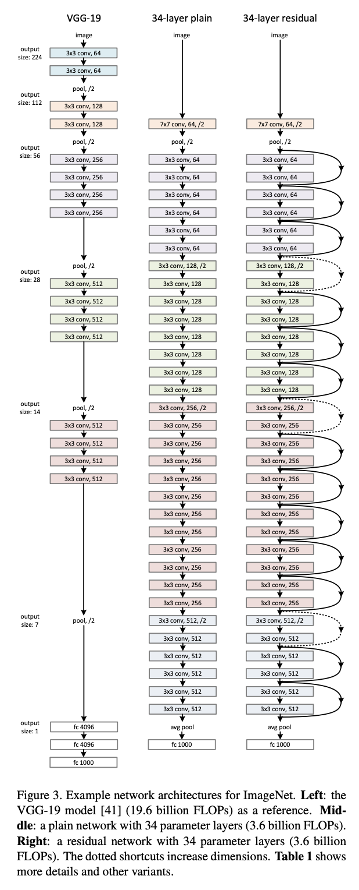

# PyTorch模型定义

## `nn.Module`--the main building block

- 所有神经网络的基类（要继承的类）--`torch.nn`模块下的`nn.Module`
- 模型定义应包括两个主要部分：各部分的初始化`__init__`,数据流向定义`forward` 
  - `forward(self,x)`：接收Variable of input data，**必须**返回Variable of output data
  - 可以使用`Modules` defined in constructor和arbitrary operators on variables

## Custom Module Use case:

> 官网：In general, it is recommended to **define a custom module for anything beyond the simplest use cases**, as this gives full flexibility on how submodules are used for a module’s computation.

- Module可以contain other Modules-->使用Sequential, ModuleList, ModuleDict定义的模块(**useful building blocks** for developing more elaborate functionality)

## Sequential--direct list

- 对应`nn.Sequential()`模块

- <u>使用场景</u>：当模型的前向计算为**简单串联(in-order chaining of modules)**各个层的计算时，且只有**single input and output**;当已经明确要使用哪些层，适用于快速验证结果
- <u>优点</u>：简单、易读、不需要写`__init__`和`forward`（因为顺序已经定义好了）
- <u>缺点</u>：使模型定义丧失灵活性，不能在模型中间加入外部输入

- <u>接收</u>：1. 有序字典[OrderedDict1 ](https://realpython.com/python-ordereddict/)[OrderedDict2](https://www.geeksforgeeks.org/ordereddict-in-python/)（dict subclass that **remembers the order** entries were added）2.一系列子模块作为参数来逐一添加Module的实例
- <u>前向计算</u>：按实例的添加顺序逐一计算

- 结合`Sequential`定义的方式理解：

```python
class MySequential(nn.Module):
    from collections import OrderedDict
    def __init__(self, *args):
        super(MySequential, self).__init__()
        if len(args) == 1 and isinstance(args[0], OrderedDict): # 如果传入的是一个OrderedDict
            for key, module in args[0].items():
                self.add_module(key, module)  # add_module方法会将module添加进self._modules(一个OrderedDict)
        else:  # 传入的是一些Module
            for idx, module in enumerate(args):
                self.add_module(str(idx), module)
    def forward(self, input):
        # self._modules返回一个 OrderedDict，保证会按照成员添加时的顺序遍历成
        for module in self._modules.values():
            input = module(input)
        return input
```

- **使用**Sequential定义模块：将模型的层按顺序排列起来

```python
# 1.直接排列
import torch.nn as nn
net = nn.Sequential(
        nn.Linear(784, 256),
        nn.ReLU(),
        nn.Linear(256, 10), 
        )
print(net)

# 2.使用OrderedDict--可以添加层名！
import collections
import torch.nn as nn
net2 = nn.Sequential(collections.OrderedDict([
          ('fc1', nn.Linear(784, 256)),
          ('relu1', nn.ReLU()),
          ('fc2', nn.Linear(256, 10))
          ]))
print(net2)
```


## ModuleList

- 对应`nn.ModuleList()`模块

- <u>接收</u>：子模块/层（继承于`nn.Module`类）的列表
  - 也可以使用list的`append`和`extend`方法操作
- <u>使用场景</u>：某些完全相同的层需要重复出现多次时，“一行顶多行”；当需要之前层的信息时，例如**ResNet**用到残差计算，需要将当前层的结果与之前层的结果进行融合
- <u>使用</u>：

```python
net = nn.ModuleList([nn.Linear(784, 256), nn.ReLU()])
net.append(nn.Linear(256, 10)) # # 类似List的append操作
print(net[-1])  # 类似List的索引访问
print(net)
```

- 注：`nn.ModuleList()`**并没有定义网络**，只是将不同的模块存储在一起；ModuleList元素的先后顺序并不代表其在网络中的真实位置顺序，**需要定义**`forward`函数指定各个层的先后顺序才算完成了模型的定义（与Sequential不同）

```python
# 模板：
class model(nn.Module):
    def __init__(self, ...):
        super().__init__()
        self.modulelist = ...
        ...
    
    def forward(self, x): #使用for循环即可完成
        for layer in self.modulelist:
            x = layer(x)
        return x


# 例子：
class Net3(nn.Module):
	def __init__(self, ...):
        super().__init__()
        self.modulelist = nn.ModuleList([nn.Linear(784, 256), nn.ReLU()])
        self.modulelist.append(nn.Linear(256, 10))
    
    def forward(self, x):
        for layer in self.modulelist:
            x = layer(x)
        return x

net3_ = Net3()
output = net3_(input)
```

## ModuleDict

- 对应`nn.ModuleDict()`模块
- 与Sequential+OrderedDict定义类似：可以指定层名称

```python
net = nn.ModuleDict({
    'linear': nn.Linear(784, 256),
    'act': nn.ReLU(),
})
net['output'] = nn.Linear(256, 10) # 添加
print(net['linear']) # 字典形式访问
print(net.output) # pytorch形式访问
print(net)

```

- 注：同样没有定义网络！只是将不同模块储存在一起
  - 此时如果要定义模型--不能是简单的for循环，需要对每个key循环或hard-coded每一层

```python
class Net3(nn.Module):
    def __init__(self, ...):
        super().__init__()
        self.net = nn.ModuleDict({
        'linear': nn.Linear(784, 256),
        'act': nn.ReLU(),
    })
        self.net['output'] = nn.Linear(256, 10) # 添加
    
    def forward(self, x):
        for key in self.net:
            x = self.net[key](x)
        return x
```

## 例子--使用自定义模型快快速搭建复杂网络

- 当模型深度非常大时，使用Sequential定义模型结构需要hard-coded几百行代码--使用不方便

- 对于大部分模型结构 eg: ResNet/DenseNet、U 我们观察会发现**模型有很多重复出现的结构**--将这些重复出现的层定义为一个“模块”，每次只需要向网络中添加对应的模块来构建模型--简化网络构建过程

  

### U-Net

- 分割 (Segmentation) 模型的杰作，在以**医学影像**为代表的诸多领域有着广泛的应用
- 通过skip-connection/残差连接 解决了模型学习中由于**层数过多**带来的退化问题(degradation)


<u>模型退化补充：</u>

- 主要有以下几种原因：

- **过拟合**，层数越多，参数越复杂，泛化能力弱
- **梯度消失/梯度爆炸**，层数过多，梯度反向传播时由于链式求导连乘使得梯度过大或者过小，使得梯度出现消失/爆炸，对于这种情况，可以通过BN(batch normalization)可以解决
- 由深度网络带来的退化问题，一般情况下，网络层数越深越容易学到一些复杂特征，理论上模型效果越好，但是由于深层网络中**含有大量非线性变化**，每次变化相当于**丢失了特征的一些原始信息**，从而导致层数越深退化现象越严重。

### U-Net模型块分析

- U-Net模型的对称性；从上到下的每层由**左侧和右侧两个模型块**组成，每侧的模型**与其上下模型块**之间有链接；同时位于**同一层左右两侧**的模型块之间也有连接 "skip-connection"

组成U-Net的模型块主要有如下几个部分，如图所示：

1）每个子块内部的两次卷积（Double Convolution）

2）左侧模型块之间的下采样连接，即最大池化（Max pooling）

3）右侧模型块之间的上采样连接（Up sampling）

4）输出层的处理

### U-Net模型块实现

- 不再按照每层顺序显式写出-->先定义好**模型块**，**再定义**模型块之间的**连接顺序**和计算方式

#### 定义模型块

```python
import torch
import torch.nn as nn
import torch.nn.functional as F
# 模块1--Double Conv 蓝色箭头
class DoubleConv(nn.Module):
    """(convolution => [BN] => ReLU) * 2"""

    def __init__(self, in_channels, out_channels, mid_channels=None):
        super().__init__()
        if not mid_channels:
            mid_channels = out_channels
        self.double_conv = nn.Sequential(
            nn.Conv2d(in_channels, mid_channels, kernel_size=3, padding=1, bias=False),
            nn.BatchNorm2d(mid_channels),
            nn.ReLU(inplace=True),
            nn.Conv2d(mid_channels, out_channels, kernel_size=3, padding=1, bias=False),
            nn.BatchNorm2d(out_channels),
            nn.ReLU(inplace=True)
        )

    def forward(self, x):
        return self.double_conv(x)
# 模块2--Max Pooling层 红色箭头   
class Down(nn.Module):
    """Downscaling with maxpool then double conv"""

    def __init__(self, in_channels, out_channels):
        super().__init__()
        self.maxpool_conv = nn.Sequential(
            nn.MaxPool2d(2),
            DoubleConv(in_channels, out_channels)
        )

    def forward(self, x):
        return self.maxpool_conv(x)
# 模块3--上采样层 绿色箭头     
class Up(nn.Module):
    """Upscaling then double conv"""

    def __init__(self, in_channels, out_channels, bilinear=True):
        super().__init__()

        # if bilinear, use the normal convolutions to reduce the number of channels
        if bilinear:
            self.up = nn.Upsample(scale_factor=2, mode='bilinear', align_corners=True)
            self.conv = DoubleConv(in_channels, out_channels, in_channels // 2)
        else:
            self.up = nn.ConvTranspose2d(in_channels, in_channels // 2, kernel_size=2, stride=2) #输出的通道数减半
            self.conv = DoubleConv(in_channels, out_channels)

    def forward(self, x1, x2):
        x1 = self.up(x1)
        # input is CHW
        diffY = x2.size()[2] - x1.size()[2] #height
        diffX = x2.size()[3] - x1.size()[3] #width

        x1 = F.pad(x1, [diffX // 2, diffX - diffX // 2,
                        diffY // 2, diffY - diffY // 2])
        # if you have padding issues, see
        # https://github.com/HaiyongJiang/U-Net-Pytorch-Unstructured-Buggy/commit/0e854509c2cea854e247a9c615f175f76fbb2e3a
        # https://github.com/xiaopeng-liao/Pytorch-UNet/commit/8ebac70e633bac59fc22bb5195e513d5832fb3bd
        x = torch.cat([x2, x1], dim=1)
        return self.conv(x)
    
# 模块4--输出层(Conv) 湖蓝色箭头   
class OutConv(nn.Module):
    def __init__(self, in_channels, out_channels):
        super(OutConv, self).__init__()
        self.conv = nn.Conv2d(in_channels, out_channels, kernel_size=1)

    def forward(self, x):
        return self.conv(x)
```

#### 组装模型块

```python
class UNet(nn.Module):
    def __init__(self, n_channels, n_classes, bilinear=True):
        super(UNet, self).__init__()
        self.n_channels = n_channels
        self.n_classes = n_classes
        self.bilinear = bilinear

        self.inc = DoubleConv(n_channels, 64) #in channels,out channels
        self.down1 = Down(64, 128) #in channels,out channels
        self.down2 = Down(128, 256)
        self.down3 = Down(256, 512)
        factor = 2 if bilinear else 1
        self.down4 = Down(512, 1024 // factor)
        self.up1 = Up(1024, 512 // factor, bilinear)
        self.up2 = Up(512, 256 // factor, bilinear)
        self.up3 = Up(256, 128 // factor, bilinear)
        self.up4 = Up(128, 64, bilinear)
        self.outc = OutConv(64, n_classes)

    def forward(self, x):
        x1 = self.inc(x)
        x2 = self.down1(x1)
        x3 = self.down2(x2)
        x4 = self.down3(x3)
        x5 = self.down4(x4)
        x = self.up1(x5, x4) #用到了之前的output--skip connection
        x = self.up2(x, x3)
        x = self.up3(x, x2)
        x = self.up4(x, x1)
        logits = self.outc(x)
        return logits
```


Reference:

- 模型退化：https://zhuanlan.zhihu.com/p/139772304
- 第五章线上课本：https://datawhalechina.github.io/thorough-pytorch/%E7%AC%AC%E4%BA%94%E7%AB%A0/index.html

